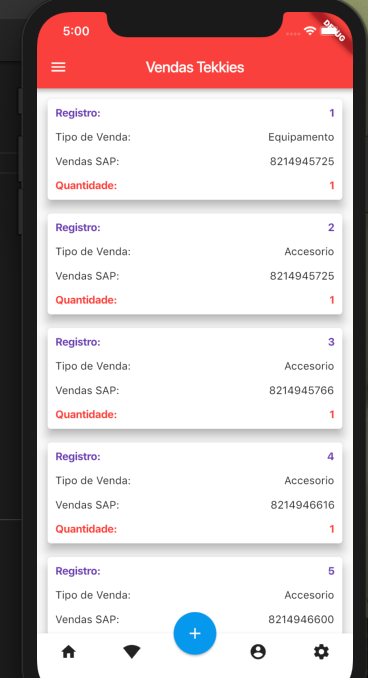

<h1 align="center">
    
</h1>

Mobile App feita em Flutter

📌 IvoVenTekkies 
------------------
O projeto foi feito com flutter e dart e php para criar uma api REST

🔧 Tecnologias utilizadas:
------------------

- FLUTTER
- DART 
- MYSQL

💬 Fale comigo
------------------
[*Entre em contato comigo*](https://www.linkedin.com/in/ivo-baptista-3712144/)

